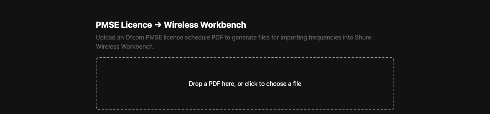
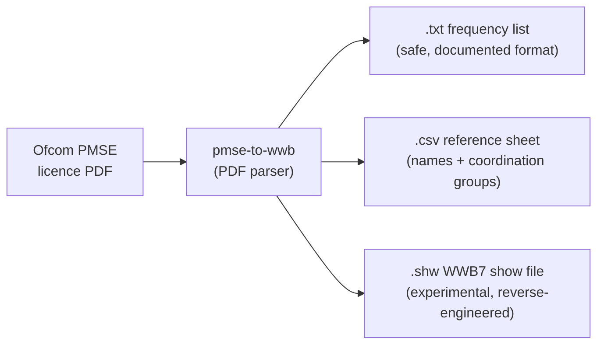

# PMSE Licence → Wireless Workbench

> **AI-assisted project.** This codebase was created with [Claude](https://claude.com/claude-code)
> (Anthropic), directed and reviewed by a human author. The code has not been independently
> audited, and the WWB `.shw` show-file format in particular is an undocumented,
> reverse-engineered format — open its output in Wireless Workbench and check it
> carefully before relying on it for a real show.

A small web app that converts an Ofcom PMSE radio microphone licence schedule (PDF) into files
for importing frequencies into Shure Wireless Workbench.





## What it does

Upload an Ofcom PMSE licence schedule PDF and the app generates:

- **WWB frequency list** (`.txt`) — a bare list of licensed frequencies in Shure's documented
  import format (MHz, ≤3 decimals, one per line). This is the safe, standards-based option:
  import it into WWB via *Import frequencies from file*.
- **Reference sheet** (`.csv`) — maps each frequency to a suggested channel name and its Ofcom
  coordination/fee group, since the licence itself has no per-mic names. Use it to manually label
  channels in WWB.
- **WWB7 show file** (`.shw`, **experimental**) — a native Wireless Workbench show file with
  channels already named and frequencies already assigned, simulating Shure AD4Q-A quad receivers.
  Shure does not publish this file format; it was reverse-engineered from a real working show file
  and has not been validated by Shure. **Open it in WWB and check it carefully before relying on it
  for a real show.**

## Status / TODO

The `.txt` and `.csv` outputs use Shure's documented import format and are stable. The show-file
generator has a [pytest suite](backend/tests) (run in CI on every push) covering the parser, both
export formats, and the show file's internal consistency (device/channel counts, XML escaping,
filler-channel handling), and it refuses to generate a `.shw` for any band other than G56 rather
than silently mislabelling other Shure receiver hardware. The main open item:

- [ ] **Validate the experimental `.shw` show file in real Wireless Workbench** across more WWB
  versions and receiver models beyond the single AD4Q-A/G56 file it was reverse-engineered from —
  automated tests can check internal consistency, but not whether WWB itself accepts the file.

## Running locally

```
python3 -m venv venv
./venv/bin/pip install -r backend/requirements.txt
./venv/bin/uvicorn main:app --reload --port 8420 --app-dir backend
```

Then open http://localhost:8420.

## Deploying

### Render

The repo includes a `render.yaml` for deploying to [Render](https://render.com) via its
Blueprint feature: **New → Blueprint**, pick this repo, and **Apply**. It builds from the
`Dockerfile` and exposes a free-tier web service.

### Docker / docker-compose (self-hosting)

A pre-built image is published to GitHub Container Registry on every push to `master`:
`ghcr.io/allansargeant/pmse-to-wwb:latest`. It is multi-arch (`linux/amd64` + `linux/arm64`),
so it runs on ARM hosts (Raspberry Pi, Apple-Silicon Docker, ARM servers) as well as x86.

To run it with `docker compose`:

```bash
git clone https://github.com/allansargeant/pmse-to-wwb.git
cd pmse-to-wwb
docker compose up -d --build
```

This builds from the local `Dockerfile` and serves the app on **http://localhost:8420**
(edit the `ports:` mapping in `docker-compose.yml` to change the host port). The container
restarts automatically and has a healthcheck against `/health`.

To run the pre-built GHCR image directly instead of building locally:

```bash
docker run -d --name pmse-to-wwb --restart unless-stopped \
  -p 8420:8000 \
  ghcr.io/allansargeant/pmse-to-wwb:latest
```

### Unraid

An Unraid Community Applications template is included at
[`unraid/pmse-to-wwb.xml`](unraid/pmse-to-wwb.xml), so the app can be added and managed from the
Unraid Docker UI like any other addon:

1. On your Unraid server, open a terminal (Unraid web UI → top-right icon → **Terminal**, or SSH
   in) and download the template:
   ```bash
   wget -O /boot/config/plugins/dockerMan/templates-user/pmse-to-wwb.xml \
     https://raw.githubusercontent.com/allansargeant/pmse-to-wwb/master/unraid/pmse-to-wwb.xml
   ```
2. In the Unraid web UI, go to **Docker → Add Container**.
3. In the **Template** dropdown at the top, select **pmse-to-wwb** — the fields (image, port)
   will be pre-filled.
4. Review the **WebUI Port** (defaults to host `8420` → container `8000`) and click **Apply**.
5. Once running, it appears in your Docker tab with a WebUI button, or visit
   `http://<unraid-ip>:8420`.

The template pulls `ghcr.io/allansargeant/pmse-to-wwb:latest`, so make sure that package is set
to **public** visibility on GitHub (Packages → pmse-to-wwb → Package settings) — otherwise Unraid
can't pull it without registry credentials.
